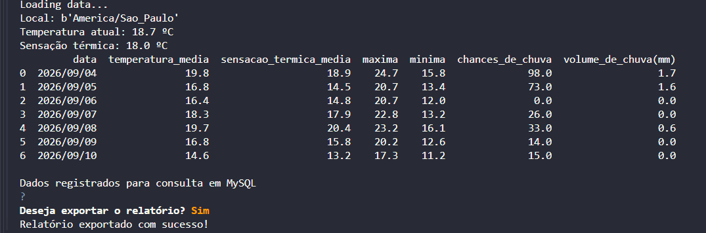
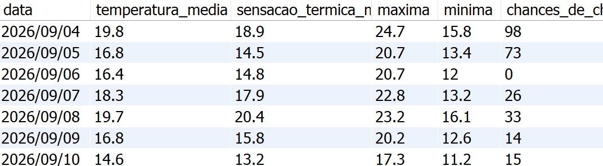

# 🌦️ WeatherLog

> 🇧🇷 Português | [🇺🇸 English below](#️-weatherlog-1)

---

Pipeline assíncrono em Python que consome a API pública Open-Meteo, registra o histórico semanal de clima em MySQL, trata os dados com Pandas e gera um relatório exportável em CSV.

Projeto desenvolvido de forma independente — a proposta de escopo (async + consumo de API + Pandas) foi sugerida como desafio de mentoria, mas toda a arquitetura, lógica de tratamento e construção do código foram desenvolvidas de forma completamente autoral.

---

## 🎯 Problema

---

Decisões do dia a dia (ir de bike, planejar uma atividade externa) costumam ser tomadas só olhando a previsão pontual do momento, sem nenhum histórico de padrão climático da própria região. O WeatherLog registra a semana inteira pra permitir esse tipo de análise.

---

## 🔁 Fluxo do sistema

---

Busca dados na API (Open-Meteo) → registra o histórico bruto em SQLite → trata os dados com Pandas → exibe no terminal → persiste o histórico tratado em MySQL → pergunta se o usuário deseja exportar → se sim, gera o relatório semanal com resumos agregados e exporta em CSV.

---

## 🚀 Tecnologias & conceitos aplicados

---

- `asyncio` — orquestração assíncrona do fluxo principal (`asyncio.gather`)
- Consumo de API externa (Open-Meteo) via `openmeteo_requests`
- `requests_cache` + `retry_requests` — cache de resposta HTTP e retry automático com backoff
- Tratamento de exceções tipadas por camada: `httpx.TimeoutException`, `httpx.ConnectError`, `httpx.HTTPStatusError` na camada de consumo da API; `asyncio.TimeoutError`, `asyncio.CancelledError`, `asyncio.InvalidStateError` na orquestração
- Pandas — tratamento de tipos (data e valores numéricos), agregações (`.mean()`, `.sum()`, `.max()`, `.min()`) para o relatório semanal
- SQLite — armazenamento local do histórico bruto de consulta
- SQLAlchemy + MySQL — persistência do histórico tratado
- `python-dotenv` — variáveis de ambiente para a string de conexão do banco
- `questionary` — prompt interativo assíncrono no terminal (confirmação de exportação)
- Pytest — primeiro teste unitário real do projeto, isolando a função de tratamento de dados de qualquer dependência de API

---

## 🧠 Decisões técnicas

---

- **Fixar a cidade (São Paulo) e o período (7 dias) no escopo inicial.** Decisão consciente para manter o projeto terminável, deixando parametrização de cidade/período como evolução futura, não como requisito do MVP.
- **Separação por responsabilidade de camada.** `app/data` concentra tudo que toca a API (cliente, sessão com cache/retry, parsing de resposta); `app/functions` concentra orquestração e tratamento; `app/database` concentra persistência e geração de relatório. Cada camada trata suas próprias exceções, com o tipo de erro que realmente pode ocorrer naquele contexto.
- **Interação explícita com o usuário antes de exportar.** Em vez de gerar o CSV automaticamente, o sistema pergunta (`questionary`) se o usuário deseja exportar — mantendo controle manual sobre o resultado final, coerente com a forma como venho tratando interação em outros pontos do projeto.
- **Resumo semanal concentrado em uma única linha do relatório**, em vez de repetir o mesmo valor agregado em todas as linhas — decisão para manter o CSV final limpo e sem redundância visual.
- **Cache e retry na sessão HTTP**, adicionados por conta própria além do escopo combinado inicialmente, para tornar o consumo da API mais resiliente a falhas transitórias e evitar chamadas repetidas desnecessárias.

---

## ⚠️ Maiores desafios

---

- Entender a diferença entre `axis=0` e `axis=1` no Pandas, e por que agregações de resumo semanal não podem cruzar colunas de significados diferentes
- Estruturar corretamente `.loc[linha, coluna] = valor` para escrever um resultado agregado em uma única célula do DataFrame, sem espalhar o valor em todas as linhas
- Resolver `ModuleNotFoundError` de importação de pacote — descoberta de que o Pytest exige `__init__.py` também na pasta de testes, não só nos módulos da aplicação
- Entender por que funções que dependem de API (grupo instável, sem controle sobre disponibilidade/tempo de resposta) não são boas candidatas a teste automatizado direto, isolando-as das funções de lógica pura antes de testar
- Corrigir um `TabError` causado por mistura de tabs e espaços na indentação, mesmo com o código visualmente idêntico entre as linhas
- Ajustar o uso de exceções específicas em cada camada, evitando tanto o `except` genérico demais quanto o tratamento aplicado onde não há risco real

---

## 🖥️ Demonstração

---

**Execução no terminal — busca, tratamento e exportação:**



**Dados persistidos no MySQL:**



---

## 🗂️ Estrutura do projeto

---

```
WeatherLog/
├── app/
│   ├── data/            # client, response, setup, current_weather, daily_weather — camada de API
│   ├── functions/       # init, data_treatment, loading — orquestração e tratamento
│   ├── database/        # connection, report — persistência e relatório
│   └── main.py          # orquestração assíncrona do fluxo
├── tests/                # testes com Pytest
├── run.py                # ponto de entrada
├── config.py
├── requirements.txt
└── weather_report.csv    # relatório exportado
```

---

## ▶️ Como executar

---

```
git clone https://github.com/oJuanMarco/WeatherLog
cd WeatherLog
pip install -r requirements.txt
```

**Pré-requisito:** é necessário ter um servidor MySQL rodando localmente (localhost) e configurar a string de conexão em um arquivo `.env` na raiz do projeto (`DATABASE_URL`), para que a persistência do histórico funcione. Sem essa conexão ativa, a etapa de registro em MySQL falha.

```
python run.py
```

---

## 👤 Autor

---

**Juan Marco**
[](https://www.linkedin.com/in/ojuanmarco/)
[](https://github.com/oJuanMarco)

---
---

# 🌦️ WeatherLog

Asynchronous Python pipeline that consumes the public Open-Meteo API, logs the weekly weather history to MySQL, processes the data with Pandas, and generates an exportable CSV report.

An independently developed project — the scope proposal (async + API consumption + Pandas) was suggested as a mentorship challenge, but all architecture, processing logic, and code were developed entirely and autonomously by the author.

---

## 🎯 Problem

---

Day-to-day decisions (biking to a destination, planning an outdoor activity) are usually made by only checking the current forecast, with no historical view of the local weather pattern. WeatherLog logs a full week to enable that kind of analysis.

---

## 🔁 System flow

---

Fetch data from the API (Open-Meteo) → log the raw history to SQLite → process the data with Pandas → display it in the terminal → persist the processed history to MySQL → ask the user whether to export → if yes, build the weekly report with aggregated summaries and export it to CSV.

---

## 🚀 Technologies & concepts applied

---

- `asyncio` — asynchronous orchestration of the main flow (`asyncio.gather`)
- External API consumption (Open-Meteo) via `openmeteo_requests`
- `requests_cache` + `retry_requests` — HTTP response caching and automatic retry with backoff
- Layer-specific typed exception handling: `httpx.TimeoutException`, `httpx.ConnectError`, `httpx.HTTPStatusError` in the API layer; `asyncio.TimeoutError`, `asyncio.CancelledError`, `asyncio.InvalidStateError` in orchestration
- Pandas — type handling (date and numeric values), aggregations (`.mean()`, `.sum()`, `.max()`, `.min()`) for the weekly report
- SQLite — local storage of the raw query history
- SQLAlchemy + MySQL — persistence of the processed history
- `python-dotenv` — environment variables for the database connection string
- `questionary` — asynchronous interactive terminal prompt (export confirmation)
- Pytest — the project's first real unit test, isolating the data-treatment function from any API dependency

---

## 🧠 Technical decisions

---

- **Fixing the city (São Paulo) and period (7 days) in the initial scope.** A deliberate choice to keep the project achievable, leaving city/period parameterization as a future improvement rather than an MVP requirement.
- **Separation by layer responsibility.** `app/data` holds everything that touches the API (client, cached/retry session, response parsing); `app/functions` holds orchestration and processing; `app/database` holds persistence and report generation. Each layer handles its own exceptions, matching the errors that can actually occur in that context.
- **Explicit user interaction before exporting.** Instead of auto-generating the CSV, the system asks (`questionary`) whether the user wants to export — keeping manual control over the final output, consistent with how interaction is handled elsewhere in the project.
- **Weekly summary concentrated in a single report row**, instead of repeating the same aggregated value across every row — keeping the final CSV clean and free of visual redundancy.
- **HTTP session caching and retry**, added on my own initiative beyond the originally agreed scope, to make API consumption more resilient to transient failures and avoid unnecessary repeated calls.

---

## ⚠️ Main challenges

---

- Understanding the difference between `axis=0` and `axis=1` in Pandas, and why weekly summary aggregations can't cross columns with different meanings
- Correctly structuring `.loc[row, column] = value` to write an aggregated result into a single DataFrame cell, without spreading the value across every row
- Resolving a `ModuleNotFoundError` package import issue — discovering that Pytest requires `__init__.py` in the test folder too, not just in the application modules
- Understanding why functions that depend on an API (an unstable group, with no control over availability/response time) aren't good candidates for direct automated testing, and isolating them from pure-logic functions before testing
- Fixing a `TabError` caused by mixed tabs and spaces in indentation, even when the code looked visually identical between lines
- Fine-tuning the use of specific exceptions per layer, avoiding both overly generic `except` blocks and error handling applied where there's no real risk

---

## 🖥️ Demo

---

**Terminal run — fetching, processing, and exporting:**


**Data persisted in MySQL:**


---

## 🗂️ Project structure

---

```
WeatherLog/
├── app/
│   ├── data/            # client, response, setup, current_weather, daily_weather — API layer
│   ├── functions/       # init, data_treatment, loading — orchestration and processing
│   ├── database/        # connection, report — persistence and reporting
│   └── main.py          # asynchronous flow orchestration
├── tests/                # Pytest tests
├── run.py                # entry point
├── config.py
├── requirements.txt
└── weather_report.csv    # exported report
```

---

## ▶️ How to run

---

```
git clone https://github.com/oJuanMarco/WeatherLog
cd WeatherLog
pip install -r requirements.txt
```

**Prerequisite:** a MySQL server must be running locally (localhost), with the connection string configured in a `.env` file at the project root (`DATABASE_URL`), for history persistence to work. Without an active connection, the MySQL logging step will fail.

```
python run.py
```

---

## 👤 Author

---

**Juan Marco**
[](https://www.linkedin.com/in/ojuanmarco/)
[](https://github.com/oJuanMarco)
